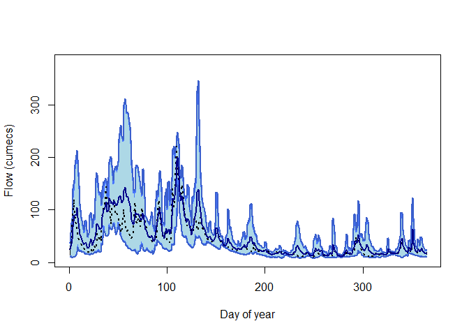
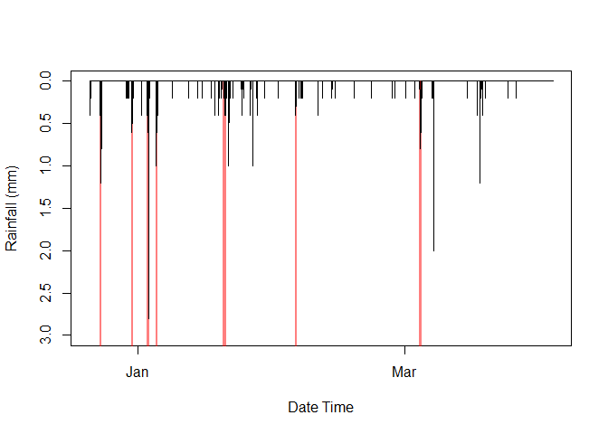

<!-- README.md is generated from README.Rmd. Please edit that file -->

# riskyData 

<!-- badges: start -->

[](https://cran.r-project.org/web/licenses/GNU%20General%20Public%20License)
[](https://github.com/JonPayneEA/riskyData)
[](https://github.com/JonPayneEA/riskyData/commits/main)

<!-- badges: end -->

## Introduction

This package is part of the fleet of `flode` tools designed for members
of Evidence and Risk. This package, `riskyData`, is used to interact
with the EAs Hydrology Data Explorer via the API. Hydrometric data can be pulled using in built
functions. Data are stored in containers that implement strict quality
controls. Data can be interrogated using a range of inbuilt tools.

## Installation and loading

You can install the development version of riskyData from
[GitHub](https://github.com/) with:

``` r
# install.packages("devtools")
devtools::install_github("JonPayne88/riskyData")
```

To load the package use;

``` r
library(riskyData)
```

## Example 1 - Importing data

To find the data available for a gauge;

``` r
## WISKI ID 2002
loadAPI(ID = '2002')
#>    measure period          type
#> 1:    flow    900 instantaneous
#> 2:    flow  86400           min
#> 3:    flow  86400          mean
#> 4:   level  86400           max
#> 5:    flow  86400           max
#> 6:   level    900 instantaneous
#> 7:   level  86400           min
```

To drill further into the data use;

``` r
loadAPI(ID = '2002',
        measure = 'flow',
        period = 900,
        type = 'instantaneous',
        datapoints = 'range',
        from = '2012-10-01 00:00',-
        to = '2013-10-01 00:00')
```

    #> ℹ Compiling parameters for raw download✔ Compiling parameters for raw download [621ms]
    #> ℹ Downloading raw data✔ Downloading raw data [2.8s]
    #> ℹ Collating metadata✔ Collating metadata [663ms]
    #> ℹ Exporting data to HydroImport container✔ Exporting data to HydroImport container [396ms]
    #> 
    #> ── Class: HydroImport ──────────────────────────────────────────────────────────
    #> 
    #> ── Private: ──
    #> 
    #> Data Type: Raw Import
    #> Station name: Evesham
    #> WISKI ID: 2002
    #> Data Type: Flow
    #> Modifications: NA
    #> Start: 2012-10-01
    #> End: 2013-09-30 23:45:00
    #> Time Step: 900
    #> Observations: 35040
    #> Easting: 404007
    #> Northing: 243741
    #> Longitude: -1.94292
    #> Latitude: 52.091994
    #> 
    #> ── Public: ──
    #>                   dateTime value quality
    #>     1: 2012-10-01 00:00:00 10.50    Good
    #>     2: 2012-10-01 00:15:00 10.40    Good
    #>     3: 2012-10-01 00:30:00 10.40    Good
    #>     4: 2012-10-01 00:45:00 10.40    Good
    #>     5: 2012-10-01 01:00:00 10.40    Good
    #>    ---                                  
    #> 35036: 2013-09-30 22:45:00  4.64    Good
    #> 35037: 2013-09-30 23:00:00  4.64    Good
    #> 35038: 2013-09-30 23:15:00  4.64    Good
    #> 35039: 2013-09-30 23:30:00  4.64    Good
    #> 35040: 2013-09-30 23:45:00  4.64    Good
    #> For more details use the $methods() function, the format should be as
    #> `Object_name`$methods()

## Example 2 - compile daily flow statistics

``` r
## Import the Bewdley dataset
data(bewdley)

## Using a pipe calculate the hydrological year and then calculate statistics
bewdley$hydroYearDay()$dayStats(plot = TRUE)
#> ℹ Calculating hydrological year and day✔ Calculating hydrological year and day [12.9s]
```



    #>      dayYear     Mean Median  Min Max   Perc5 Perc25  Perc75 Perc95
    #>   1:       1 39.17188  19.30 9.68 210 10.4000 12.200  35.600 192.00
    #>   2:       2 47.99227  25.80 9.64 225 10.2000 12.400  62.500 215.00
    #>   3:       3 53.14900  34.55 9.26 255  9.9715 11.600  67.725 228.00
    #>   4:       4 59.77555  40.65 9.39 252  9.9400 10.900  87.425 240.00
    #>   5:       5 63.06871  34.70 9.76 228 10.2000 11.700 106.000 189.85
    #>  ---                                                               
    #> 361:     361 33.29305  15.05 9.26 222 10.1000 10.975  35.925 163.85
    #> 362:     362 36.36758  15.85 8.77 254  9.8800 11.300  28.500 245.00
    #> 363:     363 38.64064  16.10 9.53 254  9.8115 11.000  26.100 250.00
    #> 364:     364 42.81338  16.20 9.35 247  9.8445 12.175  38.125 214.85
    #> 365:     365 40.54762  15.70 9.65 196 10.8000 12.500  31.550 172.00

## Example 3 - Use run length encoding to seperate rainfall events

``` r
## Import the Chesterton rain gauge data
data(chesterton)

## Calculate rain separation use RLE, minimum total event must be at least 2mm
rainSep(dateTime = chesterton$data$dateTime,
        precip = chesterton$data$value,
        threshold = 0,
        minTotal = 2,
        roll = 0)
#>       id               start                 end total
#>   1:   1 2011-01-07 08:30:00 2011-01-07 10:00:00   6.5
#>   2:   2 2011-01-11 02:15:00 2011-01-11 03:00:00   2.0
#>   3:   3 2011-01-13 20:30:00 2011-01-13 22:15:00   5.0
#>   4:   4 2011-02-19 06:45:00 2011-02-19 08:30:00   4.0
#>   5:   5 2011-02-26 00:30:00 2011-02-26 01:15:00   3.0
#>  ---                                                  
#> 861: 861 2022-09-09 14:30:00 2022-09-09 14:45:00   8.4
#> 862: 862 2022-09-09 15:30:00 2022-09-09 16:15:00   6.0
#> 863: 863 2022-09-26 10:00:00 2022-09-26 10:15:00   3.6
#> 864: 864 2022-09-30 14:15:00 2022-09-30 17:00:00   5.8
#> 865: 865 2022-09-30 18:00:00 2022-09-30 19:30:00   3.8
```

These can be integrated into plots;

``` r
## Plot the base data
plot(chesterton$data$dateTime[34000:44000], chesterton$data$value[34000:44000],
     ylim = rev(range(chesterton$data$value[30000:40000], na.rm = TRUE)),
    type = 'h', ylab = "Rainfall (mm)", xlab = "Date Time")

## Calculate the rain profiles using a 5hr aggregation
dayRain <- rainSep(dateTime = chesterton$data$dateTime[34000:44000],
                   precip = chesterton$data$value[34000:44000],
                   threshold = 0,
                   minTotal = 2,
                   roll = 20)

## Plot the identified windows
for (i in seq_along(dayRain$id)){
 polygon(x = c(dayRain$start[i], dayRain$start[i], dayRain$end[i],
               dayRain$end[i]),
         y = c(0, 12, 12, 0),
         col = scales::alpha('red', 0.5),
         border = NA)
}

## Overlay the original rainfall for clarity
lines(chesterton$data$dateTime[34000:44000], chesterton$data$value[34000:44000])
```


