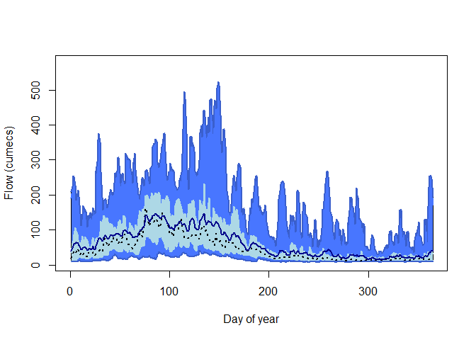

<!-- README.md is generated from README.Rmd. Please edit that file -->

# riskyData 

<!-- badges: start -->

[](https://cran.r-project.org/web/licenses/GNU%20General%20Public%20License)
[](https://github.com/JonPayneEA/HydroEnR)
<!-- badges: end -->

# Welcome to riskyData!

This package is part of the fleet of flode tools designed for members of
Evidence and Risk. This package, riskyData, is used to interact with the
EAs API. Hydrometric data can be pulled using in built functions. Data
are stored in containers that implement strict quality controls. Data
can be interrogated using a range of inbuilt tools.

## Installation

You can install the development version of riskyData from
[GitHub](https://github.com/) with:

``` r
# install.packages("devtools")
devtools::install_github("JonPayne88/riskyData")
```

## Example 1 - Loading data

``` r
library(riskyData)
## basic example code
x <- mtcars$wt
y <- mtcars$mpg

plot(x, y, main = "Main title",
     xlab = "X axis title", ylab = "Y axis title",
     pch = 19, frame = FALSE)
```


